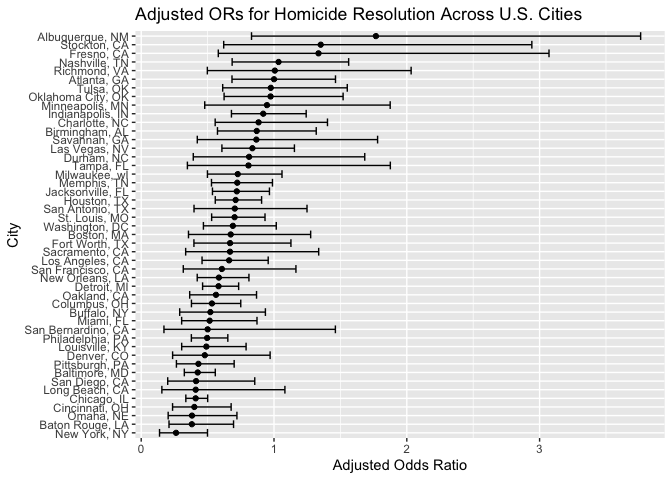
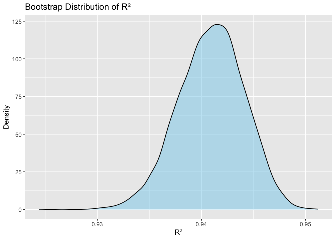
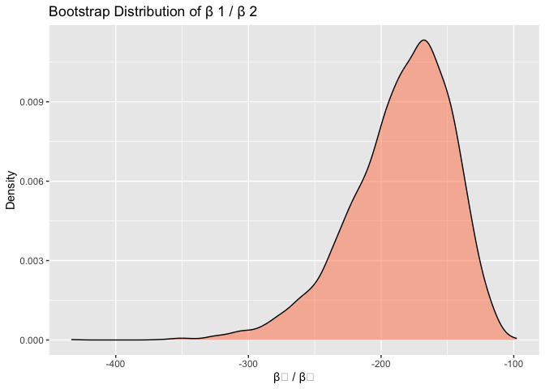
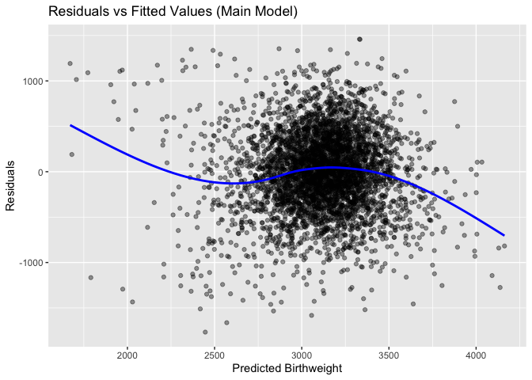

p8105_hw6_jkh2157
================
2025-12-01

# Problem 1

#### Data Cleaning

``` r
homicide_df = 
  read_csv("data/homicide-data.csv") |>
  mutate(
    city_state = str_c(city, state, sep = ", "),
    victim_age = as.numeric(victim_age),
    victim_race = fct_relevel(victim_race, "White")
  ) |>
  filter(
    !(city_state %in% c("Dallas, TX", "Phoenix, AZ", "Kansas City, MO", "Tulsa, AL")),
    victim_race %in% c("White", "Black")
  ) |>
  mutate(resolved = as.numeric(disposition == "Closed by arrest"))
```

    ## Rows: 52179 Columns: 12
    ## ── Column specification ────────────────────────────────────────────────────────
    ## Delimiter: ","
    ## chr (9): uid, victim_last, victim_first, victim_race, victim_age, victim_sex...
    ## dbl (3): reported_date, lat, lon
    ## 
    ## ℹ Use `spec()` to retrieve the full column specification for this data.
    ## ℹ Specify the column types or set `show_col_types = FALSE` to quiet this message.

    ## Warning: There was 1 warning in `mutate()`.
    ## ℹ In argument: `victim_age = as.numeric(victim_age)`.
    ## Caused by warning:
    ## ! NAs introduced by coercion

``` r
#checking to make sure that it correctly dropped those states 

homicide_df |> 
  distinct(city_state) |> 
  filter(city_state %in% c(
    "Dallas, TX",
    "Phoenix, AZ",
    "Kansas City, MO",
    "Tulsa, AL"
  ))
```

    ## # A tibble: 0 × 1
    ## # ℹ 1 variable: city_state <chr>

#### Logistic Regression for Baltimore

``` r
baltimore_df =
  homicide_df |> 
  filter(city_state == "Baltimore, MD")

fit_baltimore =
  baltimore_df |>
  glm(resolved ~ victim_age + victim_race + victim_sex,
      data = _,
      family = binomial())

baltimore_or =
  fit_baltimore |>
  tidy() |>
  mutate(OR = exp(estimate)) |>
  select(term, log_OR = estimate, OR, p.value)

baltimore_or |> 
  filter(term == "victim_sexMale")
```

    ## # A tibble: 1 × 4
    ##   term           log_OR    OR  p.value
    ##   <chr>           <dbl> <dbl>    <dbl>
    ## 1 victim_sexMale -0.854 0.426 6.26e-10

``` r
#creating a nicer table 

baltimore_results =
  fit_baltimore |> 
  tidy() |>
  mutate(
    OR = exp(estimate),
    ci_lower = exp(estimate - 1.96 * std.error),
    ci_upper = exp(estimate + 1.96 * std.error)
  ) |>
  filter(term == "victim_sexMale") |>
  select(
    term,
    log_OR = estimate,
    OR,
    ci_lower,
    ci_upper,
    p.value
  )

baltimore_results |> 
  knitr::kable(digits = 3)
```

| term           | log_OR |    OR | ci_lower | ci_upper | p.value |
|:---------------|-------:|------:|---------:|---------:|--------:|
| victim_sexMale | -0.854 | 0.426 |    0.325 |    0.558 |       0 |

**Interpretation**: Holding age and race constant, male victims have
significantly lower odds of having their homicide solved compared to
female victims. The adjusted odds ratio is 0.43, indicating that the
odds of case resolution for male victims are about 57% lower than for
female victims. The association is also statistically significant
(p\<0.0001)

#### Linear Regression for other cities: Using nest and map

``` r
city_results =
  homicide_df |> 
  nest(data = -city_state) |>
  mutate(
    models = map(data, \(df)
      glm(resolved ~ victim_age + victim_race + victim_sex,
          data = df,
          family = binomial())
    ),
    results = map(models, tidy)
  ) |>
  select(-data, -models) |>
  unnest(results) |>
  mutate(OR = exp(estimate)) |>
  filter(term == "victim_sexMale") |>
  group_by(city_state) |>
  mutate(
    ci_lower = exp(estimate - 1.96 * std.error),
    ci_upper = exp(estimate + 1.96 * std.error)
  ) |>
  ungroup()

#creating nicer tables 
city_results_table =
  city_results |> 
  select(
    city_state,
    log_OR = estimate,
    OR,
    ci_lower,
    ci_upper,
    p.value
  ) |>
  arrange(OR)

city_results_table |> 
  knitr::kable(digits = 3)
```

| city_state         | log_OR |    OR | ci_lower | ci_upper | p.value |
|:-------------------|-------:|------:|---------:|---------:|--------:|
| New York, NY       | -1.338 | 0.262 |    0.138 |    0.499 |   0.000 |
| Baton Rouge, LA    | -0.964 | 0.381 |    0.209 |    0.695 |   0.002 |
| Omaha, NE          | -0.961 | 0.382 |    0.203 |    0.721 |   0.003 |
| Cincinnati, OH     | -0.917 | 0.400 |    0.236 |    0.677 |   0.001 |
| Chicago, IL        | -0.891 | 0.410 |    0.336 |    0.501 |   0.000 |
| Long Beach, CA     | -0.891 | 0.410 |    0.156 |    1.082 |   0.072 |
| San Diego, CA      | -0.884 | 0.413 |    0.200 |    0.855 |   0.017 |
| Baltimore, MD      | -0.854 | 0.426 |    0.325 |    0.558 |   0.000 |
| Pittsburgh, PA     | -0.842 | 0.431 |    0.265 |    0.700 |   0.001 |
| Denver, CO         | -0.736 | 0.479 |    0.236 |    0.971 |   0.041 |
| Louisville, KY     | -0.712 | 0.491 |    0.305 |    0.790 |   0.003 |
| Philadelphia, PA   | -0.701 | 0.496 |    0.378 |    0.652 |   0.000 |
| San Bernardino, CA | -0.692 | 0.500 |    0.171 |    1.462 |   0.206 |
| Miami, FL          | -0.663 | 0.515 |    0.304 |    0.872 |   0.013 |
| Buffalo, NY        | -0.653 | 0.521 |    0.290 |    0.935 |   0.029 |
| Columbus, OH       | -0.630 | 0.532 |    0.378 |    0.750 |   0.000 |
| Oakland, CA        | -0.574 | 0.563 |    0.365 |    0.868 |   0.009 |
| Detroit, MI        | -0.541 | 0.582 |    0.462 |    0.734 |   0.000 |
| New Orleans, LA    | -0.536 | 0.585 |    0.422 |    0.811 |   0.001 |
| San Francisco, CA  | -0.498 | 0.608 |    0.317 |    1.165 |   0.134 |
| Los Angeles, CA    | -0.413 | 0.662 |    0.458 |    0.956 |   0.028 |
| Sacramento, CA     | -0.402 | 0.669 |    0.335 |    1.337 |   0.255 |
| Fort Worth, TX     | -0.402 | 0.669 |    0.397 |    1.127 |   0.131 |
| Boston, MA         | -0.395 | 0.674 |    0.356 |    1.276 |   0.226 |
| Washington, DC     | -0.371 | 0.690 |    0.468 |    1.017 |   0.061 |
| St. Louis, MO      | -0.352 | 0.703 |    0.530 |    0.932 |   0.014 |
| San Antonio, TX    | -0.350 | 0.705 |    0.398 |    1.249 |   0.230 |
| Houston, TX        | -0.341 | 0.711 |    0.558 |    0.907 |   0.006 |
| Jacksonville, FL   | -0.329 | 0.720 |    0.537 |    0.966 |   0.028 |
| Memphis, TN        | -0.324 | 0.723 |    0.529 |    0.988 |   0.042 |
| Milwaukee, wI      | -0.319 | 0.727 |    0.499 |    1.060 |   0.098 |
| Tampa, FL          | -0.214 | 0.808 |    0.348 |    1.876 |   0.619 |
| Durham, NC         | -0.208 | 0.812 |    0.392 |    1.683 |   0.576 |
| Las Vegas, NV      | -0.178 | 0.837 |    0.608 |    1.154 |   0.278 |
| Savannah, GA       | -0.143 | 0.867 |    0.422 |    1.780 |   0.697 |
| Birmingham, AL     | -0.139 | 0.870 |    0.574 |    1.318 |   0.511 |
| Charlotte, NC      | -0.123 | 0.884 |    0.557 |    1.403 |   0.600 |
| Indianapolis, IN   | -0.085 | 0.919 |    0.679 |    1.242 |   0.582 |
| Minneapolis, MN    | -0.054 | 0.947 |    0.478 |    1.875 |   0.876 |
| Oklahoma City, OK  | -0.026 | 0.974 |    0.624 |    1.520 |   0.908 |
| Tulsa, OK          | -0.025 | 0.976 |    0.614 |    1.552 |   0.917 |
| Atlanta, GA        |  0.000 | 1.000 |    0.684 |    1.463 |   1.000 |
| Richmond, VA       |  0.006 | 1.006 |    0.498 |    2.033 |   0.987 |
| Nashville, TN      |  0.034 | 1.034 |    0.685 |    1.562 |   0.873 |
| Fresno, CA         |  0.289 | 1.335 |    0.580 |    3.071 |   0.496 |
| Stockton, CA       |  0.301 | 1.352 |    0.621 |    2.942 |   0.447 |
| Albuquerque, NM    |  0.570 | 1.767 |    0.831 |    3.761 |   0.139 |

``` r
model.matrix(~ victim_sex, data = homicide_df) |> head()
```

    ##   (Intercept) victim_sexMale victim_sexUnknown
    ## 1           1              0                 0
    ## 2           1              0                 0
    ## 3           1              0                 0
    ## 4           1              1                 0
    ## 5           1              1                 0
    ## 6           1              0                 0

**Interpretation**: Across U.S. cities, the adjusted odds of solving a
homicide are consistently lower for male victims than for female
victims, even after controlling for age and race.

#### Plot estimated ORs and CI

``` r
city_results |> 
  ggplot(aes(x = fct_reorder(city_state, OR), y = OR)) +
  geom_point() +
  geom_errorbar(aes(ymin = ci_lower, ymax = ci_upper)) +
  coord_flip() +
  labs(
    x = "City",
    y = "Adjusted Odds Ratio",
    title = "Adjusted ORs for Homicide Resolution Across U.S. Cities"
  )
```

<!-- -->

# Problem 2

#### Looking at data set

``` r
data("weather_df")

weather_df =
  weather_df |> 
  drop_na(tmax, tmin, prcp)
```

#### Linear Model and Bootstrap samples

``` r
fit = lm(tmax ~ tmin + prcp, data = weather_df)

#checking 
glance(fit)
```

    ## # A tibble: 1 × 12
    ##   r.squared adj.r.squared sigma statistic p.value    df logLik    AIC    BIC
    ##       <dbl>         <dbl> <dbl>     <dbl>   <dbl> <dbl>  <dbl>  <dbl>  <dbl>
    ## 1     0.941         0.941  2.73    17245.       0     2 -5259. 10526. 10549.
    ## # ℹ 3 more variables: deviance <dbl>, df.residual <int>, nobs <int>

``` r
tidy(fit)
```

    ## # A tibble: 3 × 5
    ##   term        estimate std.error statistic  p.value
    ##   <chr>          <dbl>     <dbl>     <dbl>    <dbl>
    ## 1 (Intercept)  7.78     0.0854       91.0  0       
    ## 2 tmin         1.02     0.00558     182.   0       
    ## 3 prcp        -0.00558  0.000593     -9.41 1.21e-20

``` r
#drawing samples 
set.seed(1)
boot_straps =
  weather_df |> 
  modelr::bootstrap(n = 5000)

#compute 
boot_results =
  boot_straps |> 
  mutate(
    models = map(strap, \(df) lm(tmax ~ tmin + prcp, data = df)),
    glance = map(models, broom::glance),
    tidy   = map(models, broom::tidy)
  ) |>
  mutate(
    r2 = map_dbl(glance, "r.squared"),
    beta_ratio = map_dbl(tidy, \(x) {
      b1 = x |> filter(term == "tmin") |> pull(estimate)
      b2 = x |> filter(term == "prcp") |> pull(estimate)
      b1 / b2
    })
  ) |>
  select(r2, beta_ratio)

#Creating clean table with all of these estimates 
orig_table =
  tibble(
    quantity = c("R-squared", "beta_tmin", "beta_prcp", "beta_ratio"),
    estimate = c(
      glance(fit)$r.squared,
      tidy(fit) |> filter(term == "tmin") |> pull(estimate),
      tidy(fit) |> filter(term == "prcp") |> pull(estimate),
      (tidy(fit) |> filter(term == "tmin") |> pull(estimate)) /
        (tidy(fit) |> filter(term == "prcp") |> pull(estimate))
    )
  )

orig_table |> knitr::kable(digits = 3)
```

| quantity   | estimate |
|:-----------|---------:|
| R-squared  |    0.941 |
| beta_tmin  |    1.017 |
| beta_prcp  |   -0.006 |
| beta_ratio | -182.400 |

### Plotting

#### R squared Distribution

``` r
boot_results |> 
  ggplot(aes(x = r2)) +
  geom_density(fill = "skyblue", alpha = 0.5) +
  labs(
    title = "Bootstrap Distribution of R²",
    x = "R²",
    y = "Density"
  )
```

<!-- -->

#### Beta Distribution

``` r
boot_results |> 
  ggplot(aes(x = beta_ratio)) +
  geom_density(fill = "coral", alpha = 0.5) +
  labs(
    title = "Bootstrap Distribution of β 1 / β 2",
    x = "β₁ / β₂",
    y = "Density"
  )
```

<!-- -->

**Interpretation for the bootstrap distribution of R Squared**: The
bootstrap distribution of R squared is very narrow (0.93-0.95) and
tightly centered around ~0.94, indicating that the linear model
consistently explains about 94% of the variation in maximum temperature
across resampled datasets. The small spread of the distribution shows
that the model’s explanatory power is highly stable since the repeated
sampling produces nearly identical values. This suggests that the
relationship between tmax and its predictors is strong and not that
sensitive to sampling variability.

**Interpretation for the bootstrap distribution of Betas**: The
distribution of the coefficient ratio is much wider and skewed compared
to R squared. This shows that there is greater sampling variability in
the ratio. Looking at the estimates, the prcp coefficient is near 0
which likely explains why small estimation differences across resamples
is magnified. Therefore, the coefficients are much more sensitive and
not as stable.

#### Confidence intervals

``` r
boot_ci =
  boot_results |> 
  summarize(
    r2_lower  = quantile(r2, 0.025),
    r2_upper  = quantile(r2, 0.975),
    br_lower  = quantile(beta_ratio, 0.025),
    br_upper  = quantile(beta_ratio, 0.975)
  )

boot_ci |> 
  knitr::kable(digits = 3)
```

| r2_lower | r2_upper | br_lower | br_upper |
|---------:|---------:|---------:|---------:|
|    0.934 |    0.947 | -274.795 | -125.484 |

**Interpretation**:

- 2.5th percentile and 97.5th percentile of the bootstrap distribution
  serve as the lower and upper bounds of the 95% CI.
- The 95% CI for R^2 (0.934–0.947) is very narrow, showing that the
  model’s explanatory power is strong and highly stable.
- The much wider CI for the coefficient ratio (–275 to –125) reflects
  high variability, driven by the very small precipitation coefficient.

# Problem 3

#### Load data

``` r
birthweight_df =
  read_csv("data/birthweight.csv") |>
  mutate(
    babysex = factor(babysex),
    malform = factor(malform),
    mrace   = factor(mrace),
    frace   = factor(frace)
  )
```

    ## Rows: 4342 Columns: 20
    ## ── Column specification ────────────────────────────────────────────────────────
    ## Delimiter: ","
    ## dbl (20): babysex, bhead, blength, bwt, delwt, fincome, frace, gaweeks, malf...
    ## 
    ## ℹ Use `spec()` to retrieve the full column specification for this data.
    ## ℹ Specify the column types or set `show_col_types = FALSE` to quiet this message.

#### Main model

``` r
model_main =
  lm(bwt ~ gaweeks + babysex + momage + ppwt + wtgain + smoken,
     data = birthweight_df)

tidy(model_main) |>
  knitr::kable(digits = 3, caption = "Main Model: Coefficient Table")
```

| term        | estimate | std.error | statistic | p.value |
|:------------|---------:|----------:|----------:|--------:|
| (Intercept) | -164.113 |    94.061 |    -1.745 |   0.081 |
| gaweeks     |   59.355 |     2.162 |    27.454 |   0.000 |
| babysex2    |  -88.747 |    13.379 |    -6.633 |   0.000 |
| momage      |   12.709 |     1.760 |     7.220 |   0.000 |
| ppwt        |    4.321 |     0.335 |    12.890 |   0.000 |
| wtgain      |   10.044 |     0.623 |    16.132 |   0.000 |
| smoken      |   -7.671 |     0.905 |    -8.476 |   0.000 |

Main Model: Coefficient Table

#### Residual Plot

``` r
birthweight_df |>
  add_predictions(model_main) |>
  add_residuals(model_main) |>
  ggplot(aes(x = pred, y = resid)) +
  geom_point(alpha = 0.4) +
  geom_smooth(se = FALSE, color = "blue") +
  labs(
    title = "Residuals vs Fitted Values (Main Model)",
    x = "Predicted Birthweight",
    y = "Residuals"
  )
```

    ## `geom_smooth()` using method = 'gam' and formula = 'y ~ s(x, bs = "cs")'

<!-- -->

**Explanation**: I created a linear model for bwt that included
gestational age, infant sex, maternal age, maternal pre pregnancy
weight, weight gain, and smoking, since these variables are known to be
well-established predictors of fetal growth. I then used
`add_predictions()` and `add_residuals()` to look at the adequacy of the
model. The plot was dense but mostly centered with only mild curvature
at the ends, which means that it should be a reasonable model for these
predictors.
